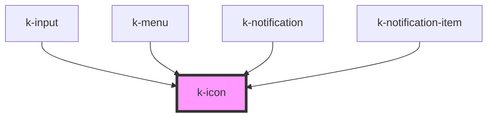

# k-icon

`k-icon` is Vuh's web component for icons.

It should receive no children, as its content is determined by the `name` prop.

<!-- Auto Generated Below -->

## Properties

| Property | Attribute | Description | Type                                                                                                                                                                                                                                                                                                                                                                                                                                                                                                                                                                                                                                                                                                                                                                                                                                                                   | Default     |
| -------- | --------- | ----------- | ---------------------------------------------------------------------------------------------------------------------------------------------------------------------------------------------------------------------------------------------------------------------------------------------------------------------------------------------------------------------------------------------------------------------------------------------------------------------------------------------------------------------------------------------------------------------------------------------------------------------------------------------------------------------------------------------------------------------------------------------------------------------------------------------------------------------------------------------------------------------- | ----------- |
| `name`   | `name`    |             | `"alert-circle" \| "assistant" \| "attachment" \| "bookmark-border" \| "bookmark" \| "cached" \| "check-circle" \| "close" \| "cloud-upload" \| "colorize" \| "delete" \| "done" \| "drag-indicator" \| "edit" \| "event" \| "file-copy" \| "finish-1" \| "finish-2" \| "finish-3" \| "flip-camera-ios" \| "school" \| "highlight-off" \| "info" \| "insert-drive-file" \| "keyboard-arrow-down" \| "keyboard-arrow-left" \| "keyboard-arrow-right" \| "keyboard-arrow-up" \| "menu" \| "network-wired" \| "notifications-active" \| "notifications" \| "person" \| "photo-camera" \| "playlist-add-check" \| "question-answer" \| "remove-red-eye" \| "ribbon" \| "search" \| "settings" \| "supervised-user-circle" \| "swap-vert" \| "swap-vert-down" \| "swap-vert-up" \| "tune" \| "view-week" \| "visibility-off" \| "add-circle" \| "bookmarks" \| "dashboard"` | `undefined` |
| `size`   | `size`    |             | `"extra-large" \| "large" \| "medium" \| "small"`                                                                                                                                                                                                                                                                                                                                                                                                                                                                                                                                                                                                                                                                                                                                                                                                                      | `'small'`   |

## Dependencies

### Used by

 - [k-input](../k-input)
 - [k-menu](../k-menu)
 - [k-notification](../k-notification)
 - [k-notification-item](../k-notification-item)

### Graph

----------------------------------------------

*Built with [StencilJS](https://stenciljs.com/)*
