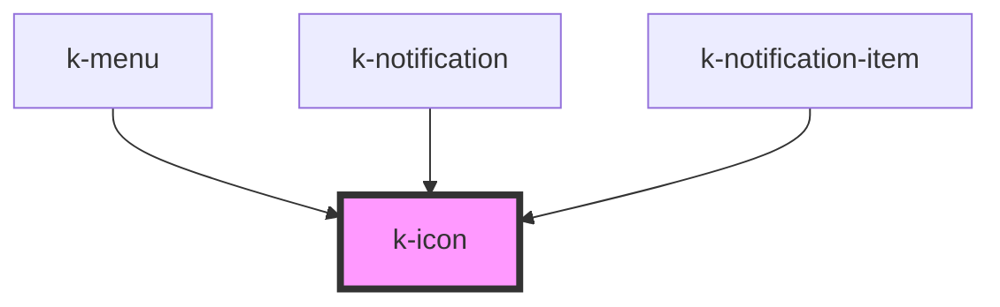

# k-icon

<!-- Auto Generated Below -->

## Properties

| Property | Attribute | Description | Type                                                                                                                                                                                                                                                                                                                                                                                                                                                                                                                                                                                                                                                                                                                                                                                                                             | Default     |
| -------- | --------- | ----------- | -------------------------------------------------------------------------------------------------------------------------------------------------------------------------------------------------------------------------------------------------------------------------------------------------------------------------------------------------------------------------------------------------------------------------------------------------------------------------------------------------------------------------------------------------------------------------------------------------------------------------------------------------------------------------------------------------------------------------------------------------------------------------------------------------------------------------------- | ----------- |
| `name`   | `name`    |             | `"alert_circle" \| "assistant" \| "attachment" \| "bookmark_border" \| "bookmark" \| "cached" \| "check_circle" \| "close" \| "cloud_upload" \| "colorize" \| "delete" \| "done" \| "drag_indicator" \| "edit" \| "event" \| "file_copy" \| "finish_1" \| "finish_2" \| "finish_3" \| "flip_camera_ios" \| "school" \| "highlight_off" \| "info" \| "insert_drive_file" \| "keyboard_arrow_down" \| "keyboard_arrow_left" \| "keyboard_arrow_right" \| "keyboard_arrow_up" \| "menu" \| "network_wired" \| "notifications_active" \| "notifications" \| "person" \| "photo_camera" \| "playlist_add_check" \| "question_answer" \| "remove_red_eye" \| "ribbon" \| "search" \| "settings" \| "supervised_user_circle" \| "swap_vert" \| "tune" \| "view_week" \| "visibility_off" \| "add_circle" \| "bookmarks" \| "dashboard"` | `undefined` |
| `size`   | `size`    |             | `"extra-large" \| "large" \| "medium" \| "small"`                                                                                                                                                                                                                                                                                                                                                                                                                                                                                                                                                                                                                                                                                                                                                                                | `'small'`   |

## Dependencies

### Used by

 - [k-menu](../k-menu)
 - [k-notification](../k-notification)
 - [k-notification-item](../k-notification-item)

### Graph

----------------------------------------------

*Built with [StencilJS](https://stenciljs.com/)*
