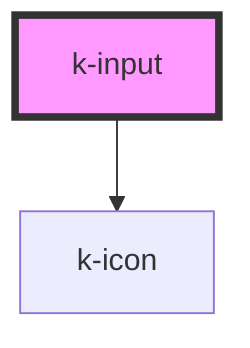

# k-input

<!-- Auto Generated Below -->

## Properties

| Property          | Attribute          | Description | Type                         | Default     |
| ----------------- | ------------------ | ----------- | ---------------------------- | ----------- |
| `disabled`        | `disabled`         |             | `boolean`                    | `false`     |
| `label`           | `label`            |             | `string`                     | `'Default'` |
| `name`            | `name`             |             | `string`                     | `''`        |
| `type`            | `type`             |             | `string`                     | `'text'`    |
| `validationState` | `validation-state` |             | `"" \| "error" \| "success"` | `''`        |
| `value`           | `value`            |             | `string`                     | `''`        |

## Dependencies

### Depends on

- [k-icon](../k-icon)

### Graph

----------------------------------------------

*Built with [StencilJS](https://stenciljs.com/)*
