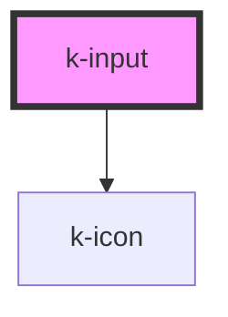

# k-input

`k-input` is Vuh's web component for an input field.

It should receive no children, as its appearence and contents are determined by props.

On React, it must use the `onInput` event to work.
On Vue, it must use `@input` to work.

<!-- Auto Generated Below -->

## Properties

| Property          | Attribute          | Description | Type                                                            | Default     |
| ----------------- | ------------------ | ----------- | --------------------------------------------------------------- | ----------- |
| `disabled`        | `disabled`         |             | `boolean`                                                       | `false`     |
| `helperText`      | `helper-text`      |             | `string`                                                        | `''`        |
| `label`           | `label`            |             | `string`                                                        | `'Default'` |
| `maxLength`       | `max-length`       |             | `number`                                                        | `0`         |
| `minLength`       | `min-length`       |             | `number`                                                        | `0`         |
| `name`            | `name`             |             | `string`                                                        | `''`        |
| `type`            | `type`             |             | `"email" \| "number" \| "password" \| "tel" \| "text" \| "url"` | `'text'`    |
| `validationState` | `validation-state` |             | `"" \| "error" \| "success"`                                    | `''`        |
| `value`           | `value`            |             | `string`                                                        | `''`        |

## Events

| Event         | Description | Type               |
| ------------- | ----------- | ------------------ |
| `valueChange` |             | `CustomEvent<any>` |

## Dependencies

### Depends on

- [k-icon](../k-icon)

### Graph

----------------------------------------------

*Built with [StencilJS](https://stenciljs.com/)*
