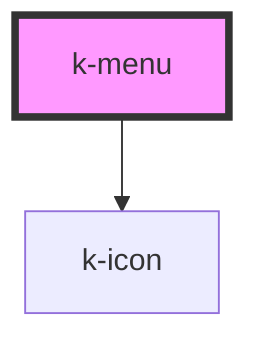

# k-menu

**_`k-menu` is a part of the `k-menu` family of components._**

`k-menu` is Vuh's web component for a menu.

It can receive `k-menu-content` and `k-menu-nav` as its children.

<!-- Auto Generated Below -->

## Properties

| Property        | Attribute        | Description | Type      | Default         |
| --------------- | ---------------- | ----------- | --------- | --------------- |
| `disableDrawer` | `disable-drawer` |             | `boolean` | `false`         |
| `hideDrawerLg`  | `hide-drawer-lg` |             | `boolean` | `false`         |
| `hideDrawerMd`  | `hide-drawer-md` |             | `boolean` | `false`         |
| `hideDrawerSm`  | `hide-drawer-sm` |             | `boolean` | `false`         |
| `hideDrawerXl`  | `hide-drawer-xl` |             | `boolean` | `false`         |
| `hideDrawerXs`  | `hide-drawer-xs` |             | `boolean` | `false`         |
| `menuKey`       | `menu-key`       |             | `string`  | `'default-key'` |

## Events

| Event        | Description | Type                                                                                                                                              |
| ------------ | ----------- | ------------------------------------------------------------------------------------------------------------------------------------------------- |
| `toggleMenu` |             | `CustomEvent<{ id: string; hideDrawerXs: boolean; hideDrawerSm: boolean; hideDrawerMd: boolean; hideDrawerLg: boolean; hideDrawerXl: boolean; }>` |

## Dependencies

### Depends on

- [k-icon](../k-icon)

### Graph

----------------------------------------------

*Built with [StencilJS](https://stenciljs.com/)*
