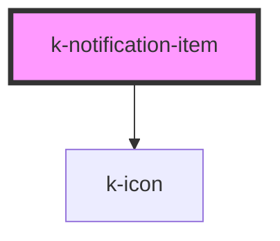

# k-notification-item

**_`k-notification-item` is a part of the `k-notification` family of components._**

`k-notification-item` is Vuh's web component for a notification item.

It must exclusively be used as a child to `k-notification-group`.

<!-- Auto Generated Below -->

## Properties

| Property     | Attribute     | Description | Type      | Default |
| ------------ | ------------- | ----------- | --------- | ------- |
| `alertColor` | `alert-color` |             | `string`  | `''`    |
| `isRead`     | `is-read`     |             | `boolean` | `false` |
| `label`      | `label`       |             | `string`  | `''`    |
| `time`       | `time`        |             | `string`  | `''`    |

## Dependencies

### Depends on

- [k-icon](../k-icon)

### Graph

----------------------------------------------

*Built with [StencilJS](https://stenciljs.com/)*
