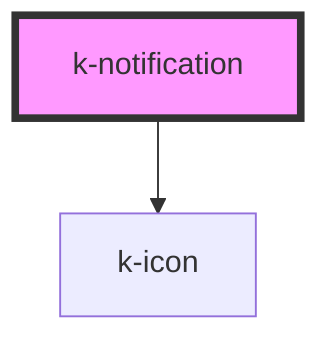

# k-notification

**_`k-notification` is a part of the `k-notification` family of components._**

`k-notification` is Vuh's web component for notifications' main container. It displays all notifications upon being hovered upon.

It must receive `k-notification-group` as its child.

<!-- Auto Generated Below -->

## Properties

| Property            | Attribute            | Description | Type                | Default   |
| ------------------- | -------------------- | ----------- | ------------------- | --------- |
| `listStart`         | `list-start`         |             | `"left" \| "right"` | `'right'` |
| `notificationCount` | `notification-count` |             | `number`            | `0`       |

## Dependencies

### Depends on

- [k-icon](../k-icon)

### Graph

----------------------------------------------

*Built with [StencilJS](https://stenciljs.com/)*
